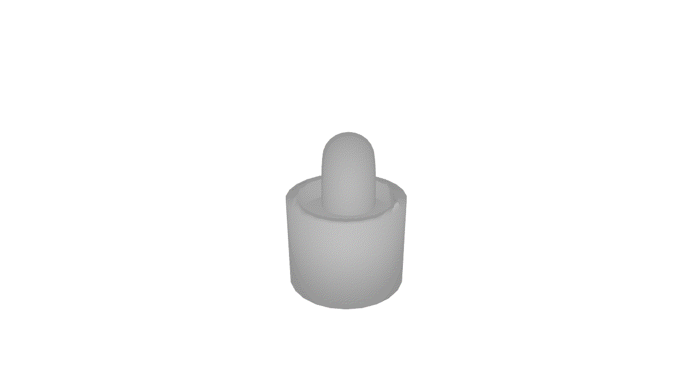

# lookit
A toolbox of eccentric functions for visualizing and processing images and meshes.

## Installation
To install:
```bash
pip install git+https://github.com/nikwl/lookit.git
```

## Functions

Create a summary render of all meshes in a given directory. 
```
python -m lookit.meshview <root_directory> <image_file.jpg> --ext .ply
```

Load a mesh, render, and view a mesh.
```python
from PIL import Image
import trimesh
import lookit

Image.fromarray(
    lookit.mesh.render(
        mesh=trimesh.load("examples/mesh.ply"),
        resolution=(1920, 1080),
        mode="RGB",
    )
).show()
```

Create a point cloud from a given camera perspective, then render and view it.
```python
from PIL import Image
import trimesh
import lookit

ptcld = lookit.mesh.render(
    mesh=trimesh.load("examples/mesh.ply"),
    resolution=(1920, 1080),
    modality="pointcloud",
)

Image.fromarray(
    lookit.mesh.render(
        mesh=lookit.mesh.trimesh_normalize(
            trimesh.PointCloud(ptcld)
        ),
        resolution=(1920, 1080),
        yrot=0,
        xrot=180,
    )
).show()
```

Create and save a rotating gif of a mesh.

```python
from PIL import Image
import trimesh
import lookit

gif = lookit.mesh.create_gif_rot(
    trimesh.load("examples/mesh.ply")
)

ptcld = lookit.mesh.render(
    mesh=trimesh.load("examples/mesh.ply"),
    resolution=(1920, 1080),
    modality="pointcloud",
)

Image.fromarray(
    lookit.mesh.render(
        mesh=lookit.mesh.trimesh_normalize(
            trimesh.PointCloud(ptcld)
        ),
        resolution=(1920, 1080),
        yrot=0,
        xrot=180,
    )
).show()
```

Plot a histogram of an image.
```bash
    ┌────────────────────────────────────────────────────────────────────────────────────────────────────┐
2.52┤                                                          ▟                                         │
    │                                                         ▗██      ▗▄▖                               │
2.10┤                                                         ▐██▌    ▗███▖                              │
1.68┤                                                         ▟██▙ ▟███████▖                             │
    │                                                         ████████████████▖                          │
1.26┤                                                        ▐█████████████████▙▄▄▄▄                     │
    │                                                       ▗▟████████████████████████▙▄▄▗▖              │
0.84┤                                                       ▐███████████████████████████████▙            │
0.42┤                                                      ▄▟█████████████████████████████████▙▖         │
    │                                                ▄▄▄▄▟██████████████████████████████████████▄▄▖      │
0.00┤▖▗ ▗▄▄▄▄▄▄▄▄▄▄▄▄▄▄▄▄▄▄▄▄▄▄▄▄▄▄▄█████████████████████████████████████████████████████████████████▄▄▄▄│
    └┬────────────────────────┬────────────────────────┬───────────────────────┬────────────────────────┬┘
     1.0                    47.5                     94.0                    140.5                  187.0 
[y] Percent of Pixels                     [x] Pixel Intensity Value                                       
data type: uint8 | shape: (1042, 3090, 3) | height: 1042 | width: 3090
```
```python
from PIL import Image
import lookit
lookit.image.summary(Image.open("img.jpg"))
```